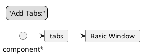

```cpp
class AbstractBook{
...
public:
	virtual ~AbstractBook() = 0;
};
```
- In some cases, we must provide an implementation for our pure virtual methods
	- Namely, if we call a pure virtual method, it **must** be implemented
	- `Text`, `Comic`, `Regular Book` all call superclass destructor
- Implement AbstractBook's destructor
```cpp
AbstractBook:: ~AbstractBook(){}
```
# Templates
- Consider `List` class again
```cpp
class List{
	struct Node{
		int data;
		Node* next;
	}
	Node* head;
	public:
		class Iterator{
			...
			int& operator*() const;
		}
		int ith(int i) const;
		void addToFront(int n);
};
```
- What if we want a list of strings, `Students`, or non integer values?
- We can copy and paste but why?
	- Instead, we use **templates!**
```cpp
// T can be any name
template<typename T> class List{
	struct Node{
		T data;
		Node* next;
	};	
	Node* head;
	public:
		class Iterator{
			...
			T& operator*() const;
		};
		T ith(int i) const;
		void addToFront(const T& n);
};
```
- User end:
```cpp
List<int> l;
l.addToFront(2);
l.addToFront(3);

// Still Valid
List<string> ls;
ls.addToFront("hello");

// Iterates in the list
for(List<int>::iterator it = l.begin(); it != l.end(); ++it){
	cout << *it << endl;
} 
List<List<int>> l3;
l3.addToFront(l);
```
- Templates at runtime are just as fast as writing a custom implementation
	- Eg. StringList, intList, studentList, etc.
- At compile time, copies of the class are created for each type `T` it is used with, then compile as normal
	- If there's a bug, you just need to fix it in the template
# Standard Template Library(Std::vector)
- Collection of useful templated classes
	- `Std::vector`, found in `<vector>`, is a resizable array!
```cpp
vector<int> v{4, 5}; // An array containing numbers 4, 5
v.emplace_back(6); // Contains 4, 5, 6
v.emplace_back(7); // Contains 4, 5, 6, 7
```
- Memory management is handled for you
- Note:
```cpp
vector<int> v(4, 5); //Contains 5, 5, 5, 5
// Fills in with four instances of 5
// for...
```
- Note: Type deduction exists:
```cpp
vector w{1, 2, 3}; // int is inferred from the list for C++11 and above
// Don't add random stuff that are not part of the type!
```
## Loop
```cpp
for(int i = 0; i < v.size(); ++i){
	cout << v[i] << endl; // v.size() returns the size of the vector
// gets ith element via operator overload
}

// Using iterator
for(vector<int>::iterator it=v.begin(); it != v.end(); ++it){
	cout << *it << endl;
}
for(int n:v) cout << n << endl;

// Loop in reverse
for(vector<int>::reverse_iterator it = v.rbegin(); it != v.rend(); ++it) cout << *it << endl;
```
## Other Useful Functions
```cpp
v.pop_back() //Removes final element
v.erase(it) //erases element pointed to by iterator it
```
- Careful using `v.erase()` in a loop!
```cpp
for(auto it = v.begin(); it != v.end(); ++it){
	if(*it == 5) v.erase(it); // Doesn't work!
}
```
- Issue:
![[vectorEraseExample.png]]
- Fix:
```cpp
for(auto it=v.begin(); it != v.end();){
	it(*it == 5)v.erase(it);
	else ++it;
}
```
- Recommended to use vectors instead of `new[]` and `delete[]`, it's safer!
# Design Patterns
- In general, we would like to program to interfaces instead of implementations
- Use abstract classes to provide methods which subclasses may customize behaviour of
```cpp
class AbstractIterator{
	virtual int&operator*() const = 0;
	virtual AbstractIterator&operator++() = 0;
	virtual bool operator != (const AbstractIterator& other) const = 0;
	virtual ~AbstractIterator(){}
}

class List{
...
public:
	class Iterator: public AbstractIterator{
		...
	}
};

class Tree{
...
public:
	class Iterator: public AbstractIterator{
		...
	}
};

// Don't need to know function parameter syntax
// Other code
void foreach(AbstractIterator& start, AbstractIterator& end, void(*f)(int)){
	while(start != end){
		f(*start);
		++start;
	}
}
```
- `foreach` is programmed using AbstractIterator's interface
	- The behaviour is customized by subclasses, writing subclasses doesn't require changes to `foreach`
# Decorator Pattern
- Problem: Add/remove functionality at runtime
	- Example: Consider GUI- windowing system
- Might want:
	- Basic window
	- Turn tabs on and off
	- A scrollbar, on and off
	- Bookmarks, on and off
- If we create a window superclass, and subclass to change the functionality, we're going to have a problem
- Instead: Use decorator pattern
```plantuml
abstract class Component{
	+ abstract operation
}

abstract class ConcreteComponent{
	+ operator()
}

abstract class Decorator

class ConcreteDecorator_A{
	+ operation()
}

class ConcreteDecorator_B{
	+ operation()
}

Component <|-- ConcreteComponent
Component <|-- Decorator
Component --* Decorator

Decorator <|-- ConcreteDecorator_A
Decorator <|-- ConcreteDecorator_B

```
- This acts like a Linked List of functionality
- `ConcreteComponent` described default behaviour, Eg. BasicWindow
- Concrete Decorators augment functionality using rest of the list


