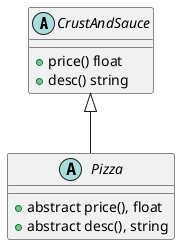

# Decorator
- Each decorator has another component that it points to
## Example: Ordering Pizza


```cpp
class Pizza{
public:
	virtual float price() const = 0;
	virtual string desc() const = 0;
	virtual ~Pizza(){
		
	}
};

class CrustAndSauce: public Pizza{
	public:
		float price() const override{return 7.99;}
		string desc() const override{return "pizza";}
};
```

```plantuml
abstract class Pizza
class CrustandSauce
abstract class decorator

Pizza <|-- CrustandSauce
Pizza <|-- decorator
Pizza --* decorator

class topping{
	+ price() float
	+ desc() string
}

class StuffedCrust
class DippingSauce

decorator <|--topping
decorator <|-- StuffedCrust
decorator <|-- DippingSauce

```
```cpp
class Decorator: public Pizza{
	protected:
		Pizza* next;
	public:
		Decorator(Pizza* p): next{p}{};
		~Decorator(){delete next;}
};
```
- Decorator is abstract as it inherits `Pizza` but did not implement `price` and `desc`
```cpp
class Topping: public Decorator{
	string name;
	public:
		Topping(string name, Pizza *p): Decorator{p}, name{name}{}

	float price() const override{
		return 0.99 + next->price();
	}
	
	string desc() const override{
		return next->desc() + " with " + name;
	}
};

class stuffedCrust: public Decorator{
	public:
		StuffedCrust(Pizza* p): Decorator{p}{}
		float price() const override{
			return 1.50 + next ->price();
		}
		string desc()const override{
			return next->desc() + " with stuffed crust ";
		}
};

Pizza* myPizza = new CrustAndSauce{};
myPizza = new Topping{"pepperoni", myPizza};
```
- What happens in the background when a new subclass is added:
```plantuml
class Conds
MyPizza ()- Conds
```
```plantuml
class Conds
MyPizza ()- Conds
class Topping
Topping --> Conds
```
```plantuml
class Conds
class Topping
MyPizza ()- Topping
Topping --> Conds
```
## Observers
- I want the same class with data to dispatch updates to other objects whenever data changes, dynamically
- Example: Spreadsheet
	- We may have different charts that must be redisplayed when a spreadsheet cell is modified
```plantuml
abstract class Subject{
	public notifyObservers()
	public attach(observer* o)
	public detach(observer* o)
}

class ConcreteSubject{
	public getState()
}

class ConcreteObserver{
	public notify()
}

abstract class Observer{
	abstract public notify()
}

Subject o-- Observer: o*
Subject <|-- ConcreteSubject
ConcreteObserver o-- ConcreteSubject
Observer <|-- ConcreteObserver

```
1. `ConcreteSubject` is changed
2. `notifyObservers` is called(inside or outside class)
3. `notify` is called for each observer in `SubjectList`
4. Each `concreteSubject` can call `getState` and update accordingly
- Example Scenario: **Twitter**
	- `ConcreteSubjects`: Tweeter, publishes tweets to Followers
	- `ConcreteObserver`: Followers, react to updates to the one Tweeted they follow
```cpp
class Subject{
	vector<observer*> observers;
	public:
		void notifyObservers()const {for (auto p: observers) p->notify();}
		void attach(Observer* o){observers.emplace_back(o); p->notify();}
		void detach(observer * o){//remove from list
		}
		virtual ~Subject() = 0;
}

Subject::~Subject(){}

public class Observer{
	virtual void notify() = 0;
	virtual ~observer(){}
};

// Concrete Subject
class Tweeter: public Subject{
	string lastTweet;
	ifStream file;
	public:
		Tweeter(const string& fileName), file{fileName}{}
		// see if file can still be read
		bool tweet(){
			getline(file, lastTweet);
			return file.good();
		}
	string getState() const {return lastTweet;}
};

// Concrete Observer
class Follower: public Observer{
	string name;
	Tweeter* iFollow;
	public:
		Follower(string name, Tweeter *t): name{name}, iFollow{t}{
			iFollow->attach(this);
		}
		void notify() override{
			string tweet = iFollow->getState();
			if(tweet.find(name) != string::npos){
				cout << "Yay";
			}
			else cout << "Boo";
		}
}

int main(){
	Tweeter elon{"elon.txt"};
	Follower joe{"Joe", &elon};
	Follower mary{"mary", &elon};
	while(elon.tweet()){
		elon.notify.observers();
	}
}
```